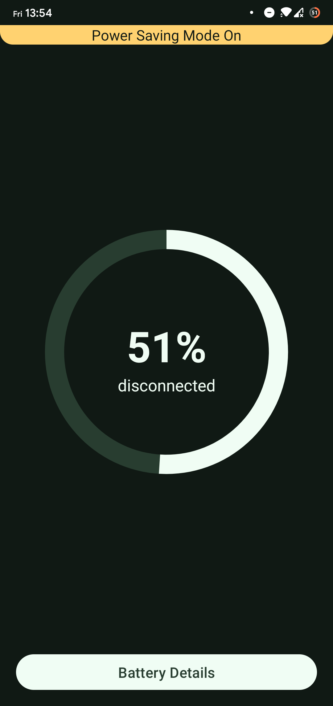
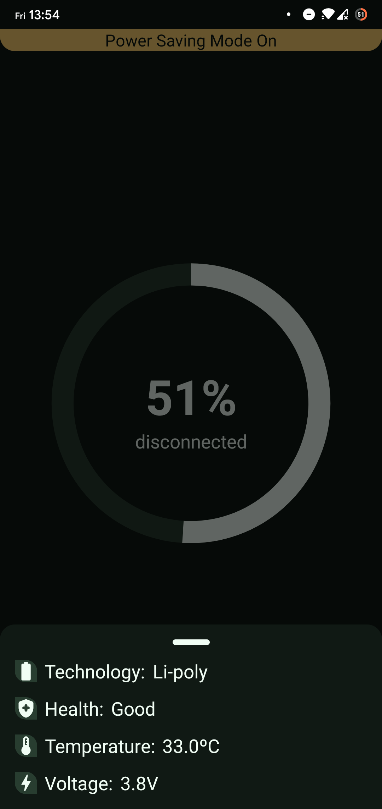
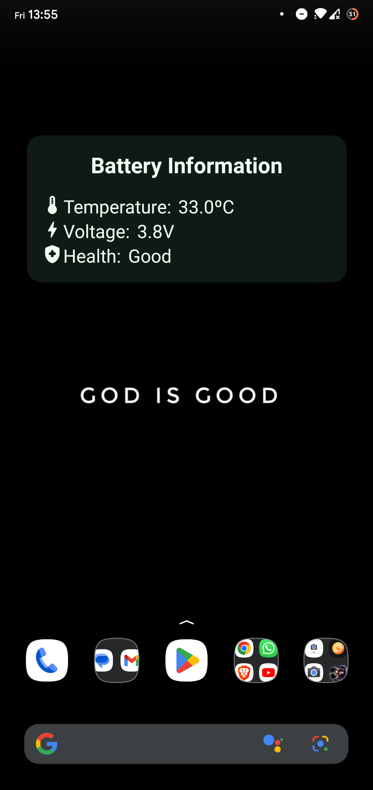
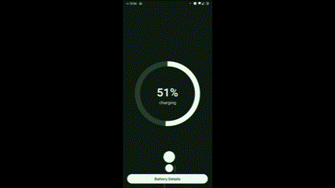

<h1 align="center">Battery Manager</h1>

  
  
   
  
  

  

⭐ Projeto para estudo de broadcast receiver, um componente da platarforma Android.

🔋 Aplicativo que permite consultar informações sobre a bateria do dispositivo.

## Download
 Faça o download da <a href="https://github.com/LucasMelll0/Battery_Monitor/raw/master/apk/battery_manager.apk">APK diretamente</a>. Você pode ver <a href="https://www.google.com/search?q=como+instalar+um+apk+no+android">aqui</a> como instalar uma APK no seu aparelho android.

## Tecnologias usadas e bibliotecas de código aberto

- Minimum SDK level 28
- [Linguagem Kotlin](https://kotlinlang.org/)

- Jetpack
  - Lifecycle: Observe os ciclos de vida do Android e manipule os estados da interface do usuário após as alterações do ciclo de vida.
  - ViewModel: Gerencia o detentor de dados relacionados à interface do usuário e o ciclo de vida. Permite que os dados sobrevivam a alterações de configuração, como rotações de tela.
  - ViewBinding: Liga os componentes do XML no Kotlin através de uma classe que garante segurança de tipo e outras vantagens.
  - Custom Views: View customizadas feitas do zero usando XML.

- Arquitetura
  - MVVM (View - ViewModel - Model)
  - Comunicação da ViewModel com a View através de LiveData
  - Comunicação da ViewModel com a Model através de Kotlin Flow
  
- Bibliotecas
  - [Lottie](https://lottiefiles.com/blog/working-with-lottie/getting-started-with-lottie-animations-in-android-app): Para carregamento de animações em json.
  - [Koin](https://insert-koin.io/): Para injeção de depêndencias.

## Arquitetura
**Valorant Wiki** utiliza a arquitetura MVVM e o padrão de Repositories, que segue as [recomendações oficiais do Google](https://developer.android.com/topic/architecture).
  

 

  
### Tela principal

Visualização da porcentagem, status da bateria e status do modo economico de bateria.

  
### Detalhes adicionais da bateria

Bottomsheet com informações da tecnologia, saúde, temperatura e voltagem atual da bateria.

## Widget

Widget com informações sobre temperatura, voltagem e saúde da bateria.

## Animação ao carregar a bateria

